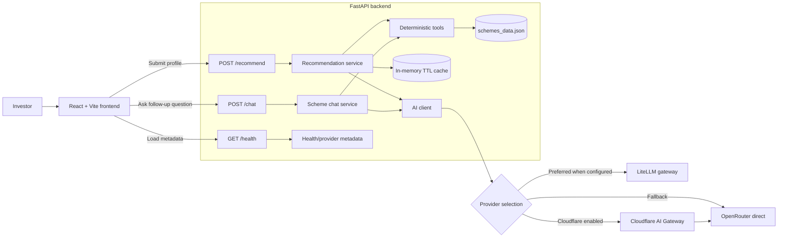
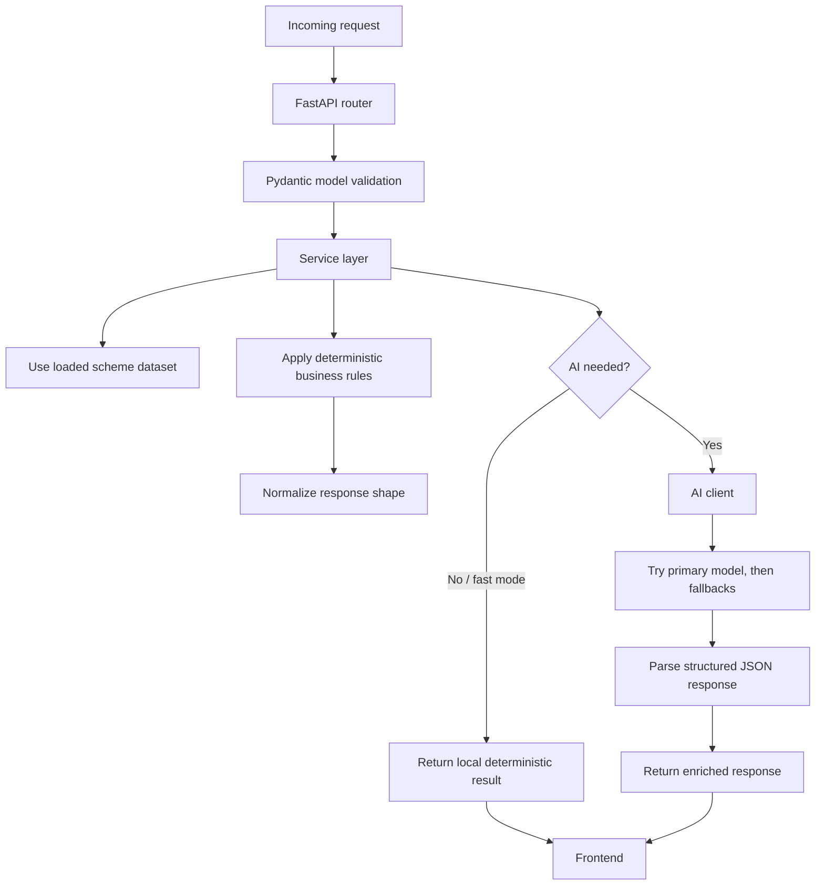
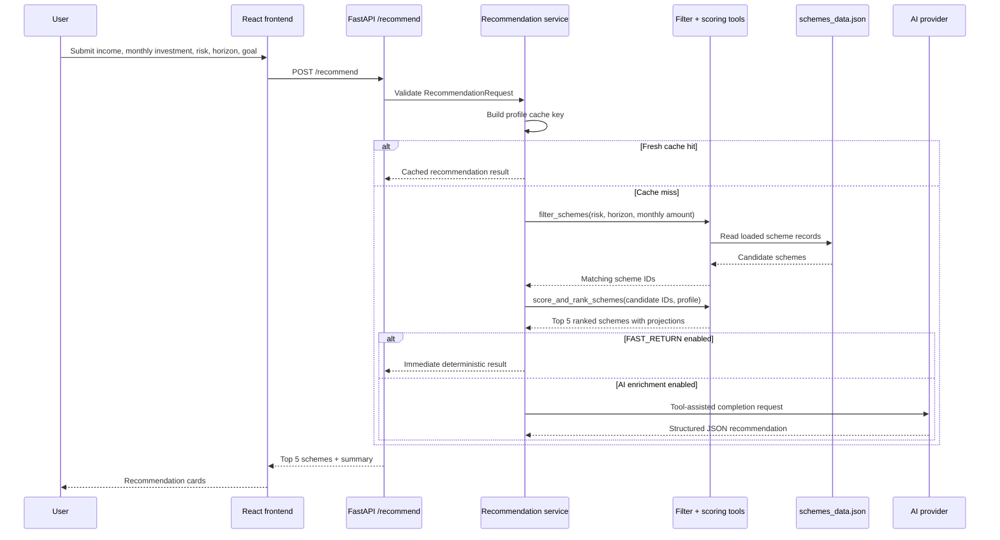
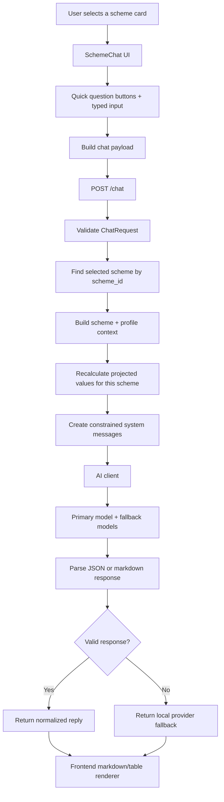
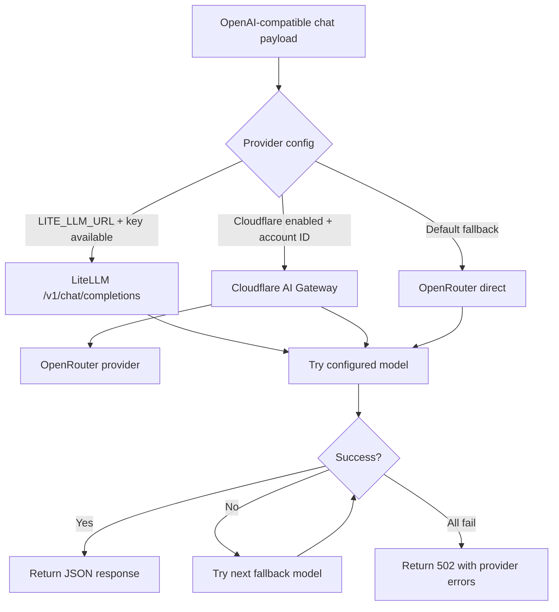
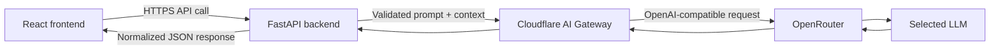
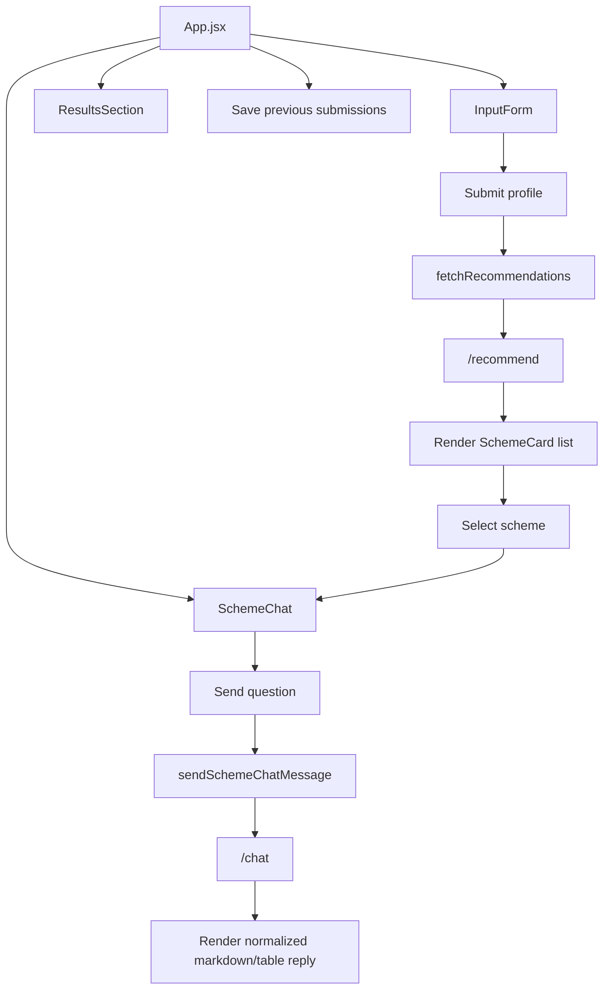

# BDT Advisor Architecture and Engineering Writeup

BDT Advisor is a full-stack Bangladesh investment recommendation platform that helps users discover suitable schemes based on monthly income, monthly investment capacity, risk tolerance, investment horizon, and target goal.

The application combines a React/Vite frontend, a FastAPI backend, a local dataset of 100+ Bangladeshi investment schemes, deterministic recommendation logic, and an AI-assisted explanation layer routed through an OpenAI-compatible provider stack.

The main engineering principle behind the system is simple: the LLM should explain and contextualize, but the backend should own the financial decision logic. That keeps the product more predictable, testable, and resilient.

## High-Level System Architecture



The frontend is responsible for interaction, input state, result display, and scheme-specific chat UX. The backend is responsible for validation, filtering, scoring, projection calculation, caching, AI provider routing, and fallback behavior.

This separation keeps the browser thin and prevents sensitive provider credentials from being exposed client-side.

## Technology Stack

| Layer | Technology | Responsibility |
|---|---|---|
| Frontend | React + Vite | User profile form, recommendation cards, scheme chat UI |
| API | FastAPI | Request validation, routing, CORS, health checks |
| Data | JSON dataset | Local source of Bangladesh investment schemes |
| Validation | Pydantic | Typed request contracts for recommendation and chat |
| Recommendation engine | Python service layer | Filtering, scoring, ranking, projection calculation |
| AI integration | OpenAI-compatible chat completions | Explanations, personalization, scheme-specific answers |
| Gateway | Cloudflare AI Gateway | Observability and provider routing in front of OpenRouter |
| Deployment | Static frontend + Python backend | Independent frontend/backend deployment model |

## Backend Workflow



The backend is organized around clear boundaries:

- `api/` contains route definitions such as `/recommend`, `/chat`, `/schemes`, and `/health`.
- `models.py` defines request and message schemas.
- `data.py` loads `schemes_data.json` once into memory.
- `tools.py` contains deterministic filtering and scoring functions.
- `services/recommendation.py` orchestrates top-5 recommendation generation.
- `services/chat.py` handles scheme-specific conversational responses.
- `services/ai_client.py` centralizes provider selection, headers, fallback models, and error handling.
- `config.py` reads deployment and provider configuration from environment variables.

This structure avoids mixing API concerns, business rules, and provider infrastructure in the same module.

## Top 5 Scheme Recommendation Process

The top-5 recommendation process is intentionally deterministic at its core. The LLM may enrich the explanation, but filtering, scoring, ranking, and projections are calculated by backend code.



The first step is hard filtering. The backend removes schemes that do not match the user profile:

- risk level must match the user’s selected tolerance
- investment horizon must fit the scheme’s allowed duration range
- monthly investment must satisfy the scheme’s minimum requirement
- flexible savings products can pass duration checks when the product type supports that behavior

After filtering, the scoring function ranks the remaining schemes using a weighted decision model:

| Factor | Weight | Purpose |
|---|---:|---|
| Interest rate | 40% | Rewards stronger expected return |
| Duration match | 25% | Favors products aligned with the user’s horizon |
| Provider trust | 15% | Gives extra confidence to government or highly trusted providers |
| Goal coverage | 20% | Measures whether projected maturity can meet the target goal |
| Liquidity bonus | +5 | Rewards highly liquid products |

The system also calculates:

- projected maturity value
- total invested amount
- projected profit
- ranking score
- scheme metadata needed by the frontend

This makes the recommendation engine explainable. If a scheme ranks highly, it is because it passed explicit filters and performed well against transparent scoring criteria.

## Recommendation Optimization Decisions

Several backend decisions were added to improve speed and reliability:

1. **Fast deterministic return**

   `FAST_RETURN` allows the backend to return local ranked results immediately. This avoids blocking the user on external LLM latency and is especially useful on free-tier deployments.

2. **Optional background enrichment**

   The recommendation service supports an enrichment path where deterministic recommendations can be returned first and AI-generated summaries can be cached later.

3. **TTL-based cache**

   Recommendations are cached by the serialized user profile. Repeated requests with the same inputs can return without recomputing filters, scores, or provider calls.

4. **Model fallback list**

   The AI client tries the primary model first, then fallback models from `AI_MODEL_FALLBACKS`. This protects the app from temporary model failures, provider instability, or free-model availability issues.

5. **Local fallback mode**

   When AI credentials are missing, the backend can still produce deterministic recommendations in development mode. The application remains useful without external AI access.

## Chat Response Process

The scheme chat feature lets a user open any recommended scheme and ask specific follow-up questions. The chat is intentionally scoped to one selected scheme and one user profile.



For every chat request, the backend builds a context package containing:

- selected scheme ID and name
- provider and scheme type
- risk level
- typical interest rate
- duration boundaries
- liquidity
- minimum monthly investment
- notes from the dataset
- projected maturity value
- total invested amount
- projected profit
- target goal gap
- goal-met status

The model is instructed to answer only the latest user question using this context. It is also told not to generate generic financial report sections unless the user explicitly requests them.

The expected model response is JSON:

```json
{
  "markdown": "Concise answer for the user"
}
```

The frontend then normalizes the response and renders it as readable chat content. It supports markdown-like formatting, bullets, simple tables, structured JSON fallback handling, quick questions, suggestions, and abortable in-flight requests.

This gives the user a conversational experience while keeping the answer grounded in backend-provided data.

## Model Selection and Provider Routing



The backend supports three provider modes:

- **LiteLLM**, when `LITE_LLM_URL` and `LITELLM_MASTER_KEY` are configured
- **Cloudflare AI Gateway**, when Cloudflare variables are configured and enabled
- **OpenRouter direct**, when no gateway layer is enabled

This is handled in `config.py` and executed through `ai_client.py`. The rest of the application does not need to know which provider is active.

## Cloudflare AI Gateway Integration

Cloudflare was added as a gateway layer in front of OpenRouter for the deployed project.



The backend builds the Cloudflare AI Gateway URL from environment variables:

```text
https://gateway.ai.cloudflare.com/v1/{CLOUDFLARE_ACCOUNT_ID}/{CLOUDFLARE_AI_GATEWAY_ID}/openrouter/chat/completions
```

The relevant configuration values are:

```env
OPENROUTER_API_KEY=your-openrouter-key
OPENROUTER_MODEL=openrouter/free
AI_MODEL_FALLBACKS=tencent/hy3-preview:free,nvidia/nemotron-3-super-120b-a12b:free,openai/gpt-oss-120b:free,google/gemma-4-31b-it:free
CLOUDFLARE_ACCOUNT_ID=your-cloudflare-account-id
CLOUDFLARE_AI_GATEWAY_ID=default
CLOUDFLARE_API_TOKEN=your-cloudflare-ai-gateway-token
USE_CLOUDFLARE_AI_GATEWAY=1
```

When Cloudflare is enabled, the backend sends the same OpenAI-compatible payload through Cloudflare instead of calling OpenRouter directly. The frontend does not change. The API contract remains stable.

The main advantages are:

- **Observability:** AI traffic can be monitored at the gateway layer.
- **Provider control:** Routing logic is centralized without rewriting frontend or service code.
- **Security:** provider keys stay on the backend, never in the browser.
- **Operational flexibility:** models and fallbacks can be adjusted through environment variables.
- **Failure isolation:** if one model fails, the backend can try another model before returning an error.
- **Cleaner deployment:** Cloudflare can be added to the deployed backend without changing the frontend architecture.

Cloudflare works here as an infrastructure boundary. The backend still validates user input, builds context, selects models, and normalizes responses. Cloudflare provides the gateway path, observability, and provider-facing control plane.

## Frontend Workflow



The frontend is intentionally focused on product experience:

- captures and submits the user profile
- saves previous submissions in browser local storage
- displays ranked recommendation cards
- opens scheme-specific chat
- supports quick questions
- supports aborting a running chat request
- renders structured AI responses into clean UI output

The frontend never calls OpenRouter, Cloudflare, or LiteLLM directly.

## Engineering Takeaways

BDT Advisor is designed as a practical AI-assisted financial product, not a generic chatbot. The backend uses deterministic rules for the critical recommendation path and uses the LLM where it adds the most value: explanation, personalization, and conversational follow-up.

The most important architecture choices were:

- keeping financial ranking logic deterministic
- constraining chat responses to selected scheme and profile context
- adding fast local responses for low-latency user experience
- supporting provider fallbacks for resilience
- routing deployed AI traffic through Cloudflare AI Gateway
- protecting credentials by keeping all provider calls server-side

The result is a system that is easier to explain, easier to debug, and more reliable than a fully prompt-driven recommendation workflow.

## LinkedIn-Ready Summary

I built BDT Advisor as a full-stack Bangladesh investment recommendation platform using React, FastAPI, deterministic scoring, and AI-assisted explanations.

The key design decision was to keep the recommendation engine rule-based and transparent. The backend filters schemes by risk level, investment duration, and minimum monthly investment, then ranks candidates using weighted criteria for return, duration match, provider trust, goal coverage, and liquidity.

AI is used carefully: not as the source of truth, but as an explanation and chat layer. The app supports scheme-specific conversations, model fallback, structured JSON responses, local fallback behavior, and Cloudflare AI Gateway routing for deployed AI traffic.

This architecture gave me a faster, safer, and more explainable system: deterministic recommendations where correctness matters, and conversational AI where context and user experience matter.
