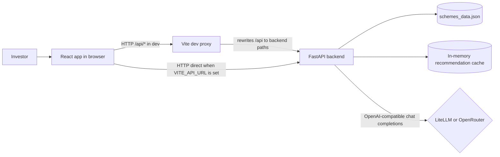
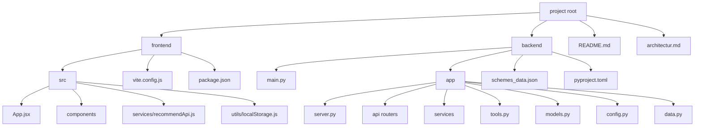
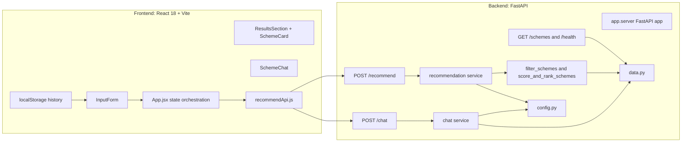
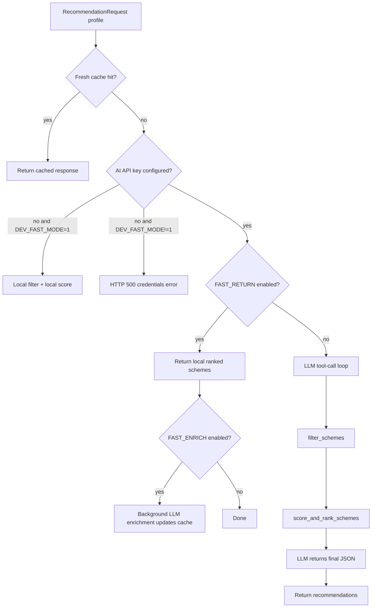
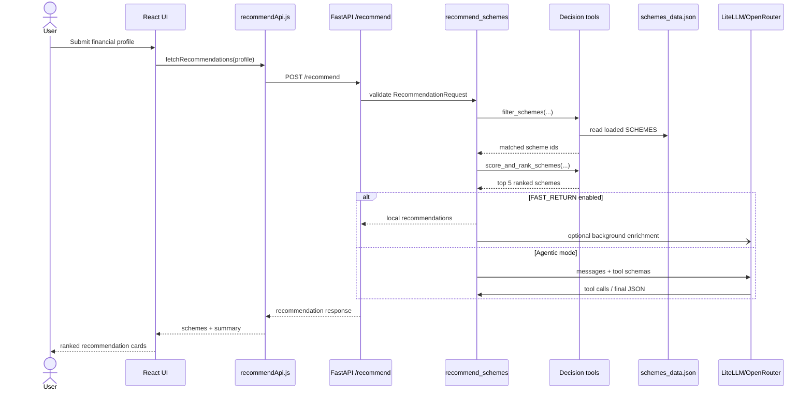
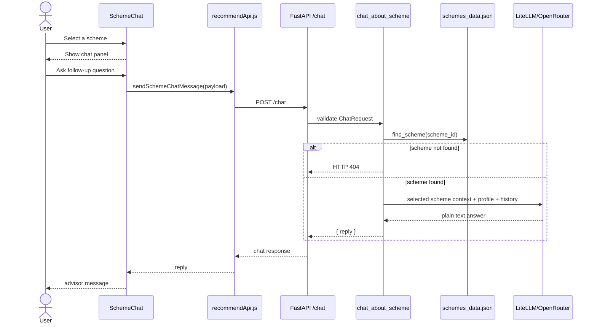
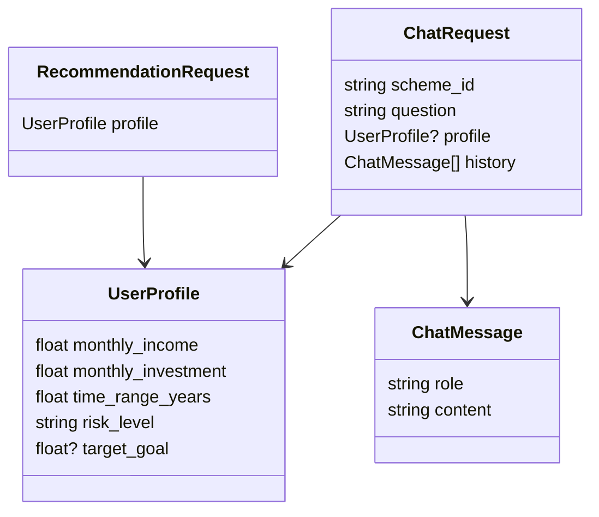
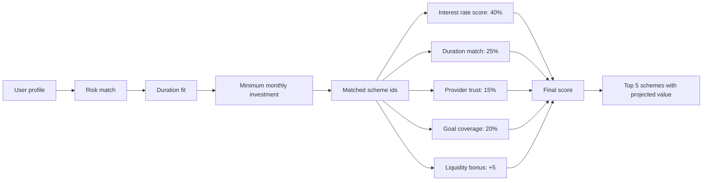
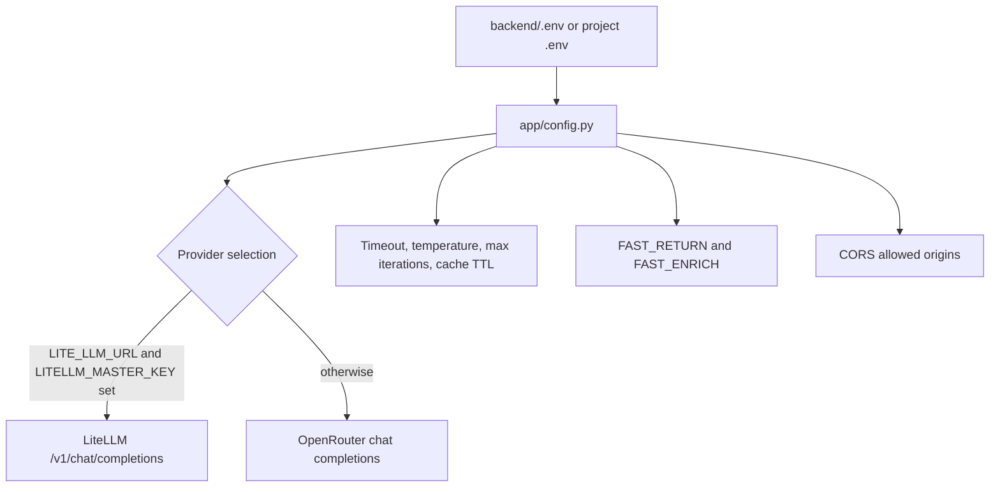
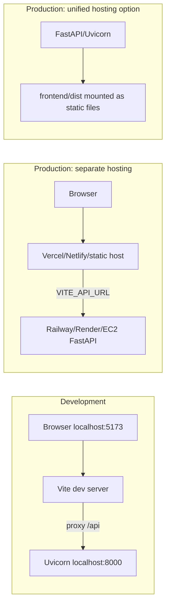

# Architecture

BDT Advisor is a full-stack Bangladesh investment recommendation application. The frontend collects a user's financial profile, the backend filters and scores local investment scheme data, and an optional LLM provider enriches recommendations and scheme-specific chat responses.

## System Context

## Repository Layout

## Runtime Components

## Backend Request Flow

## Recommendation Sequence

## Scheme Chat Sequence

## API Surface

## Data and Scoring

The backend loads `backend/schemes_data.json` once through `app.data.SCHEMES`. The recommendation engine applies hard filters first, then scores the remaining schemes.

## Configuration

Key backend settings:

- `LITE_LLM_URL`, `LITELLM_MASTER_KEY`, `LITELLM_MODEL`: use LiteLLM gateway.
- `OPENROUTER_API_KEY`, `OPENROUTER_MODEL`: fallback provider configuration.
- `FAST_RETURN`: returns local recommendations immediately when enabled.
- `FAST_ENRICH`: optionally enriches the cache in the background.
- `OPENROUTER_CACHE_TTL`: in-memory recommendation cache duration.
- `DEV_FAST_MODE`: allows local-only behavior when no AI key exists.

## Deployment View

## Important Architecture Notes

- The frontend is stateful only in the browser. Recommendation inputs are saved in browser `localStorage` for quick reuse.
- The backend does not use a database. Scheme records come from the JSON dataset and recommendation cache is process-local memory.
- Recommendation quality has two layers: deterministic filtering/scoring in `app/tools.py`, then optional LLM explanation/enrichment in `app/services/recommendation.py`.
- Chat answers are intentionally constrained to the selected scheme and user profile context.
- In dev, frontend calls `/api/recommend` and `/api/chat`; Vite rewrites those to `/recommend` and `/chat` on the backend.
- In production with separate hosting, `VITE_API_URL` must point the frontend at the deployed backend.

